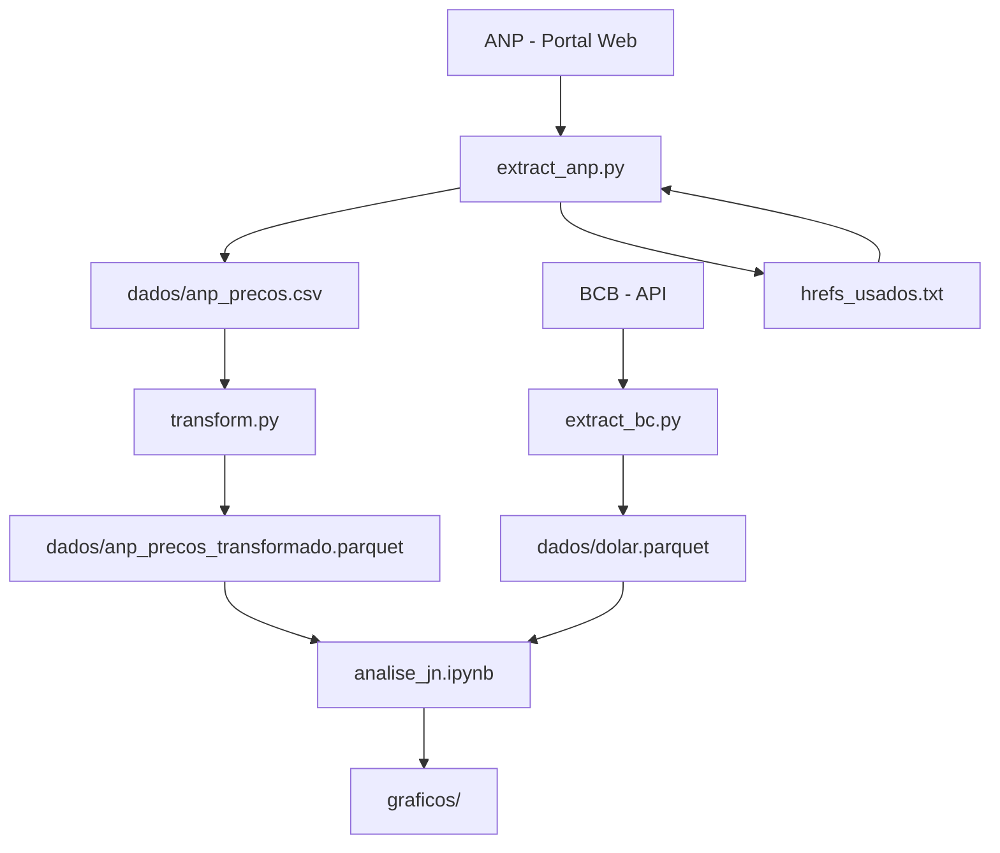

# Extração de Dados

Este projeto é responsável por extrair, processar e analisar dados de diferentes fontes, gerando visualizações e insights através de gráficos.

## Fontes de Dados

### 1. Agência Nacional do Petróleo (ANP)
- **Fonte**: [Portal da ANP - Levantamento de Preços de Combustíveis](https://www.gov.br/anp/pt-br/assuntos/precos-e-defesa-da-concorrencia/precos/levantamento-de-precos-de-combustiveis-ultimas-semanas-pesquisadas)
- **Dados extraídos**: Preços médios de combustíveis por estado e município
- **Frequência**: Semanal
- **Formato**: Arquivos Excel (.xlsx)
- **Colunas principais**:
  - Data inicial e final do período
  - Estado e município
  - Tipo de produto (combustível)
  - Número de postos pesquisados
  - Preço médio de revenda
  - Desvio padrão, preço mínimo e máximo
  - Coeficiente de variação

### 2. Banco Central do Brasil (BCB)
- **Fonte**: API do Banco Central
- **Dados extraídos**: Cotação do dólar (Taxa de câmbio - Livre - Dólar americano)
- **Frequência**: Diária
- **Período**: De 01/01/2022 até a data atual
- **Formato**: JSON via API
- **Colunas**: Data e valor da cotação

## Processamento de Dados

O projeto inclui transformações específicas para os dados da ANP:
- Limpeza de colunas com nomes "Unnamed"
- Normalização de nomes de colunas (remoção de acentos, conversão para minúsculas)
- Tratamento de valores ausentes
- Conversão de tipos de dados apropriados
- Salvamento em formato Parquet para melhor performance

## Pipeline de Dados



**Fluxo de Execução:**
1. **Extração**: Dados são coletados das fontes (ANP e BCB)
2. **Armazenamento**: Dados brutos são salvos em CSV/Parquet
3. **Transformação**: Dados da ANP são limpos e normalizados
4. **Análise**: Notebook processa dados para gerar insights
5. **Visualização**: Gráficos são gerados e salvos

## Requisitos

- Python 3.12 ou superior
- pip (gerenciador de pacotes Python)

## Instalação

1. Clone o repositório:
```bash
git clone [URL_DO_REPOSITÓRIO]
cd Extracao_dados
```

2. Crie e ative um ambiente virtual (recomendado):
```bash
# Windows
python -m venv .venv
.venv\Scripts\activate

# Linux/Mac
python -m venv .venv
source .venv/bin/activate
```

3. Instale as dependências do projeto:
```bash
pip install -e .
```

## Estrutura do Projeto

```
Extracao_dados/
├── src/                    # Código fonte do projeto
│   └── extracao_dados/
│       ├── main.py         # Script principal de execução
│       ├── extract_anp.py  # Extrator de dados da ANP
│       ├── extract_bc.py   # Extrator de dados do Banco Central
│       ├── transform.py    # Transformações dos dados
│       └── analise_jn.ipynb # Notebook de análise
├── dados/                  # Diretório para armazenamento de dados
│   ├── anp_precos.csv     # Dados brutos da ANP
│   ├── anp_precos_transformado.parquet # Dados processados da ANP
│   └── dolar.parquet      # Dados da cotação do dólar
├── graficos/              # Diretório para armazenamento de gráficos gerados
├── hrefs_usados.txt       # Controle de arquivos já baixados da ANP
├── pyproject.toml         # Configuração do projeto e dependências
└── README.md              # Este arquivo
```

## Arquivos de Dados Gerados

### Dados da ANP (`dados/anp_precos.csv`)
- **Formato**: CSV
- **Conteúdo**: Dados brutos extraídos dos relatórios semanais da ANP
- **Atualização**: Semanal, conforme disponibilização de novos relatórios

### Dados Processados da ANP (`dados/anp_precos_transformado.parquet`)
- **Formato**: Parquet (otimizado para performance)
- **Conteúdo**: Dados limpos e estruturados da ANP
- **Processamento**: Aplicação de transformações de limpeza e normalização

### Dados do Dólar (`dados/dolar.parquet`)
- **Formato**: Parquet
- **Conteúdo**: Histórico da cotação do dólar desde 01/01/2022
- **Atualização**: Diária via API do Banco Central

## Download dos Dados

> **⚠️ Nota**: Os arquivos de dados não estão incluídos no repositório Git para manter o tamanho do projeto otimizado. Para obter os dados, você pode:

### Opção 1: Executar a Extração Localmente
```bash
# Clone o repositório e execute a extração
git clone [URL_DO_REPOSITÓRIO]
cd Extracao_dados
pip install -e .
python src/main.py
```

### Opção 2: Download Direto dos Dados Processados
Os dados finais processados estão disponíveis para download via:

#### Dados da ANP Processados
- **Formato**: Parquet (otimizado)
- **Tamanho**: ~1MB
- **Download**: [anp_precos_transformado.parquet](https://drive.google.com/file/d/1x0V7bfwrLWt3UFUk1X4HEAAxNUMed5RZ/view?usp=drive_link)
- **Descrição**: Dados limpos e normalizados de preços de combustíveis por estado/município

#### Dados do Dólar
- **Formato**: Parquet
- **Tamanho**: ~16KB
- **Download**: [dolar.parquet](https://drive.google.com/file/d/1x0V7bfwrLWt3UFUk1X4HEAAxNUMed5RZ/view?usp=sharing)
- **Descrição**: Histórico da cotação do dólar desde 01/01/2022

> **💡 Dica**: Recomendamos usar os dados processados (Parquet) para melhor performance e menor tamanho.

## Dependências Principais

- requests: Para fazer requisições HTTP
- beautifulsoup4: Para web scraping
- pandas: Para manipulação e análise de dados
- openpyxl: Para trabalhar com arquivos Excel
- pyarrow: Para processamento eficiente de dados
- tqdm: Para barras de progresso
- matplotlib e seaborn: Para criação de gráficos
- statsmodels: Para análise estatística

## Uso

### Execução Completa
1. Certifique-se de que o ambiente virtual está ativado
2. Para realizar a extração ou atualização de todos os dados, execute o arquivo principal:
```bash
python src/main.py
```

### Execução Individual dos Módulos

#### Extração de Dados da ANP
```bash
python -c "from src.extracao_dados.extract_anp import extract_anp; extract_anp()"
```

#### Extração de Dados do Banco Central
```bash
python -c "from src.extracao_dados.extract_bc import extract_bc; import datetime; extract_bc('01/01/2022', datetime.datetime.now().strftime('%d/%m/%Y'))"
```

#### Transformação dos Dados da ANP
```bash
python -c "from src.extracao_dados.transform import transform_anp; transform_anp()"
```

### Controle de Downloads
- O arquivo `hrefs_usados.txt` mantém o controle dos arquivos já baixados da ANP
- Isso evita downloads duplicados e permite execuções incrementais
- Para forçar nova extração completa, delete o arquivo `hrefs_usados.txt`

### Resultados
- Os dados processados serão salvos na pasta `dados/`
- Os gráficos gerados serão salvos na pasta `graficos/`
- Arquivos em formato Parquet são otimizados para consultas rápidas

## Licença

Este projeto está licenciado sob a Licença MIT - veja o arquivo [LICENSE](LICENSE) para detalhes.

**Permissões:**
- ✅ Uso comercial
- ✅ Modificação
- ✅ Distribuição
- ✅ Uso privado

**Limitações:**
- ❌ Sem garantia
- ❌ Sem responsabilidade

## Menção às Fontes

### Dados Utilizados

Este projeto utiliza dados públicos das seguintes fontes oficiais:

#### Agência Nacional do Petróleo (ANP)
- **Fonte**: [Portal da ANP](https://www.gov.br/anp/pt-br/assuntos/precos-e-defesa-da-concorrencia/precos/levantamento-de-precos-de-combustiveis-ultimas-semanas-pesquisadas)
- **Licença**: Dados públicos governamentais
- **Atribuição**: Dados extraídos do portal oficial da ANP

#### Banco Central do Brasil (BCB)
- **Fonte**: [API do Banco Central](https://www.bcb.gov.br/estatisticas/reporttxjuros)
- **Licença**: Dados públicos governamentais
- **Atribuição**: Dados obtidos via API oficial do Banco Central

### Bibliotecas e Ferramentas

Este projeto utiliza as seguintes bibliotecas de código aberto:
- **requests**: Para requisições HTTP
- **beautifulsoup4**: Para web scraping
- **pandas**: Para manipulação de dados
- **matplotlib/seaborn**: Para visualizações
- **statsmodels**: Para análise estatística

### Citação

Se você usar este projeto em suas pesquisas ou trabalhos, por favor cite:

```
Projeto de Extração de Dados - ANP e Banco Central
Dados extraídos de fontes oficiais governamentais
```

## Contribuindo

1. Faça um fork do projeto
2. Crie uma branch para sua feature (`git checkout -b feature/nova-feature`)
3. Faça commit das suas alterações (`git commit -m 'Adiciona nova feature'`)
4. Faça push para a branch (`git push origin feature/nova-feature`)
5. Abra um Pull Request

